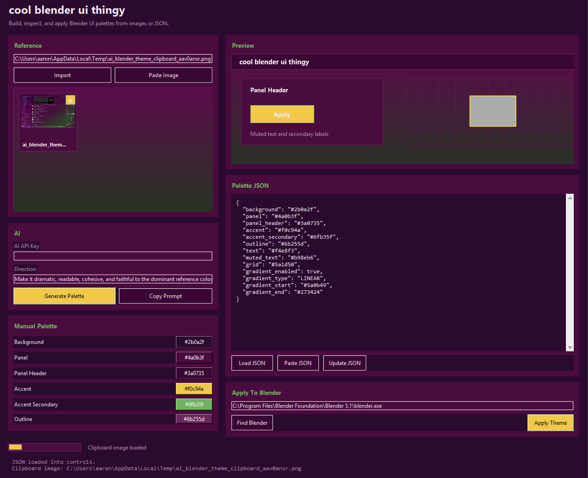

# BlenderThemeMaker

Make Blender look less default.

BlenderThemeMaker is a small Windows app for making Blender UI themes. You can build a theme manually with the color controls, use screenshots as references, or ask ChatGPT/another AI to generate a palette JSON for you. The app lets you preview the colors, save themes, and apply them straight to Blender.



## Why Use It

Use it manually if you already know the colors you want. Use the AI prompt workflow if you want to turn a screenshot, Discord theme, game UI, website, or moodboard into a Blender theme faster.

You can mix both workflows too: generate a starting palette, then tweak it by hand until it feels right.

## What It Does

- Lets you make themes manually with color controls.
- Imports one or more reference images.
- Pastes screenshots or image files from your clipboard.
- Removes reference images one at a time.
- Copies a ready-to-use prompt for ChatGPT or any other AI.
- Pastes AI JSON back into the app, even if it comes wrapped in a `json` code block.
- Supports gradients.
- Shows a live preview before you apply anything.
- Saves theme history locally.
- Lets you rename, edit, delete, and export saved themes.
- Imports the theme currently saved in Blender into the app.
- Exports the current Blender theme as a full Blender XML preset backup.
- Applies the theme directly to Blender through `blender.exe`.

## Quick Start

For the easiest setup, double-click:

```text
install_and_launch.bat
```

That checks for Python, installs the required package, and launches the app.

Manual setup:

```powershell
pip install -r requirements.txt
python .\src\cool_blender_ui_thingy.py
```

Or launch it after setup with:

```powershell
.\launch.bat
```

## Requirements

- Windows
- Python 3.10 or newer
- Blender installed locally

The app defaults to Blender 5.1 here:

```text
C:\Program Files\Blender Foundation\Blender 5.1\blender.exe
```

If your Blender is somewhere else, use `Find Blender` inside the app.

## Manual Workflow

1. Open the app.
2. Edit the colors in `Manual Palette`.
3. Choose whether you want a gradient.
4. Watch the preview update.
5. Click `Save Current Theme` if you want to keep it.
6. Click `Apply Theme`.

This is the simplest way to use the app if you already have a palette in mind.

## Existing Blender Themes

Already have a Blender theme you like? You can pull it into the app.

- `Import Current Theme` reads the theme Blender is currently using, converts the main colors into the app palette, loads it for editing, and saves it in Theme History.
- `Export Full XML` uses Blender's own theme preset exporter. Use this when you want a full backup that captures the complete Blender theme, not just the simplified app palette.
- `Replace Blender Theme` applies the palette currently shown in the app and overwrites Blender's active saved theme preferences.

Use `Export Full XML` before replacing a theme if you want a complete backup.

## No API Key AI Workflow

You do not need an API key to use AI with this.

1. Add screenshots or reference images in the app.
2. Click `Copy Prompt`.
3. Paste that prompt into ChatGPT or another AI.
4. Upload the same screenshots/reference images there.
5. Copy the JSON it gives you.
6. Come back to the app and click `Paste JSON`.
7. Tweak anything you want.
8. Click `Apply Theme`.

Restart Blender if an already-open area does not refresh right away.

## Built-In AI Option

If you do have an API key, enter it in `AI API Key` and click `Generate Palette`.

The built-in path currently uses `gemini-3-flash-preview`, but the copy/paste workflow works with ChatGPT or any AI that can follow a JSON schema.

## Theme History

Click `Save Current Theme` when you get a palette you like.

Saved themes show up as color-grid rows. From there you can:

- `Edit` loads it back into the editor.
- `Export` saves it as a `.json` file.
- `Rename` changes the saved name.
- `Delete` removes it from history.

History is stored here:

```text
%APPDATA%\BlenderThemeMaker\theme_history.json
```

## JSON Shape

If you are writing or editing JSON yourself, use this shape:

```json
{
  "background": "#0b0203",
  "panel": "#210508",
  "panel_header": "#41070d",
  "accent": "#ff1430",
  "accent_secondary": "#ff6a1f",
  "outline": "#8a1018",
  "text": "#ffe9e3",
  "muted_text": "#bf7772",
  "grid": "#75101a",
  "gradient_start": "#190306",
  "gradient_end": "#4a0710",
  "gradient_enabled": true,
  "gradient_type": "LINEAR"
}
```

`gradient_type` can be:

- `LINEAR`
- `RADIAL`
- `SINGLE_COLOR`

## Project Layout

```text
.
├── install_and_launch.bat
├── launch.bat
├── requirements.txt
├── README.md
├── screenshotapp.png
├── src/
│   └── cool_blender_ui_thingy.py
└── extras/
    ├── blender_addon/
    │   └── blender_ai_theme_studio.py
    └── legacy/
        └── apply_blender_red_theme.py
```

The main app is:

```text
src\cool_blender_ui_thingy.py
```
